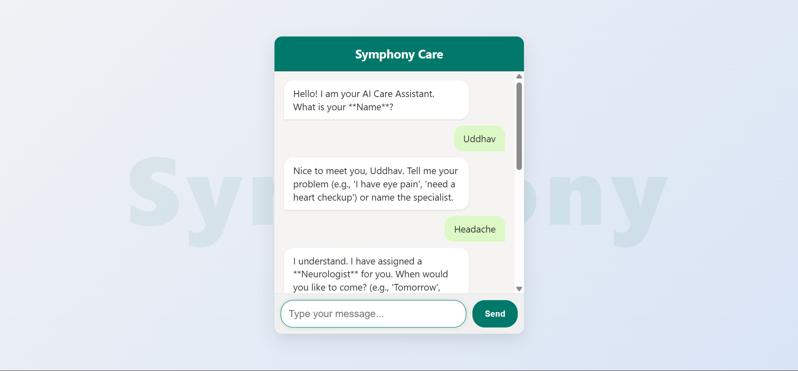
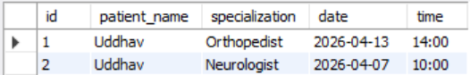

# 🏥 Symphony Care  
### AI-Powered Healthcare Appointment Assistant  

Symphony Care is a smart healthcare assistant that simplifies appointment booking through a conversational interface. It detects user symptoms, maps them to the right specialist, and stores bookings in a MySQL database.

---

## 🚀 Features  

- 🧠 Intelligent symptom → specialist mapping  
- 💬 Conversational chat-based interface  
- 📅 Natural language date parsing (*“Tomorrow”, “Next Friday”*)  
- 🆔 Session-based interaction tracking  
- 💾 MySQL-based persistent storage  

---

## 🛠️ Tech Stack  

| Layer | Technology |
|------|-----------|
| Backend | Java 17, Spring Boot |
| Frontend | HTML, CSS, JavaScript |
| Database | MySQL |
| Build Tool | Maven |

---

## ⚙️ Setup  

### 1. Clone Repository  

git clone <your-repository-url>
cd CareConnect


### 2. Database Setup

```sql
CREATE DATABASE careconnect;
USE careconnect;

CREATE TABLE appointment (
  id INT AUTO_INCREMENT PRIMARY KEY,
  patient_name VARCHAR(100),
  specialization VARCHAR(100),
  date VARCHAR(20),
  time VARCHAR(20)
);
```

### 3. Configure Credentials

```properties
spring.datasource.url=jdbc:mysql://localhost:3306/careconnect
spring.datasource.username=your_username
spring.datasource.password=your_password
```

### 4. Run Backend

```bash
./mvnw spring-boot:run
```

### 5. Run Frontend

```
Open `index.html` in your browser.
```

---

## 📸 Screenshots






---